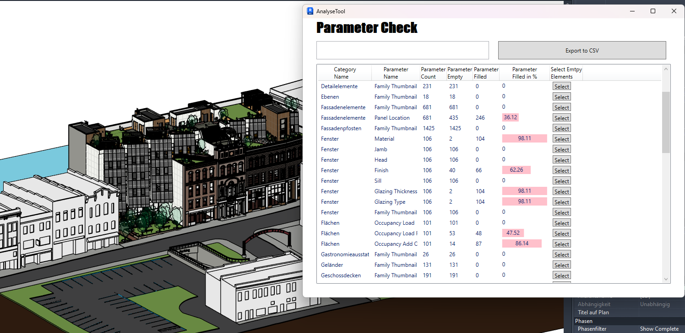
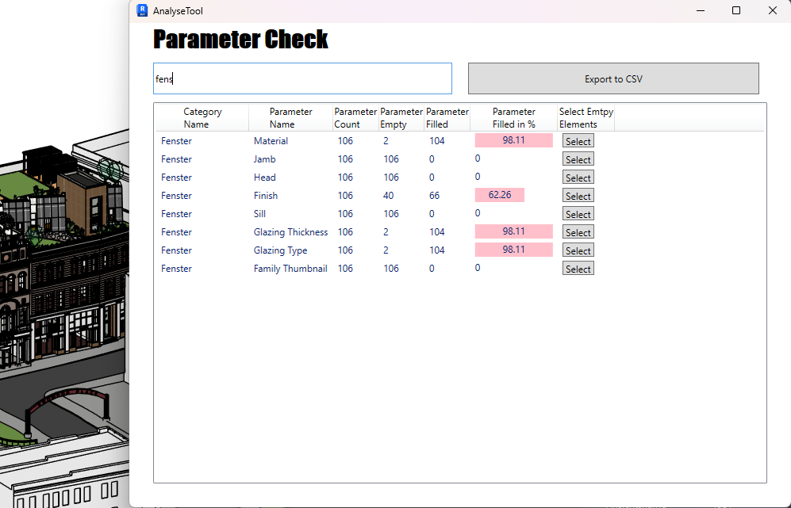

# AnalyseTool Plugin for Revit

## Overview



The AnalyseTool Plugin is a powerful tool for Autodesk Revit that allows users to analyze and export parameter data of elements within a Revit project. With this plugin, you can easily export data to CSV formats, making it easier to manage and share project information.

## Features

- **Parameter Analysis**: Analyze parameters of elements in your Revit project.
- **Export to CSV**: Export analyzed data to a CSV file.
- **Flexible Filtering**: Filter parameters based on various criteria.
- **Category Grouping**: Group parameters by categories for better organization.



## Requirements

- Autodesk Revit 2023 or higher
- .NET Framework 4.8 or higher

## Installation - in progress...

1. **place it in folder**: C:\ProgramData\Autodesk\Revit\Addins\202X

## Usage

### Analyzing Parameters

1. **Open Revit Project**: Open your project in Revit.
2. **Launch AnalyseTool**: Go to `Add-Ins` > `AnalyseTool` to launch the plugin.
3. **View Parameters**: The plugin will display a list of parameters for elements in your project.
4. **Filter Parameters**: Use the filter box to search for specific parameters.

### Exporting Data

#### Export to CSV

1. Click the `Export to CSV` button.
2. Choose the location to save the CSV file.
3. Click `Save`.

## Development

### Prerequisites

- Visual Studio 2019 or higher
- .NET Framework 4.8
- EPPlus
- iText7
- CsvHelper

### Building the Plugin

1. Clone the repository:
   ```sh
   git clone https://github.com/your-repo/AnalyseTool.git
