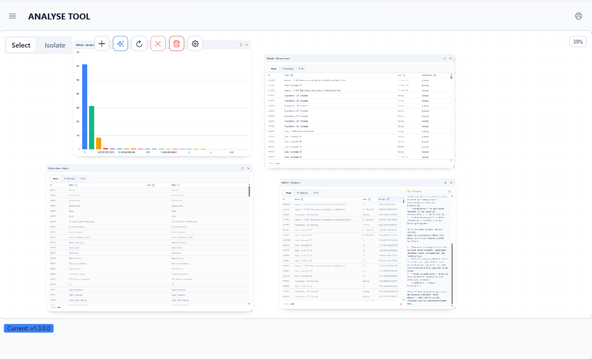
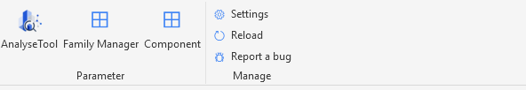
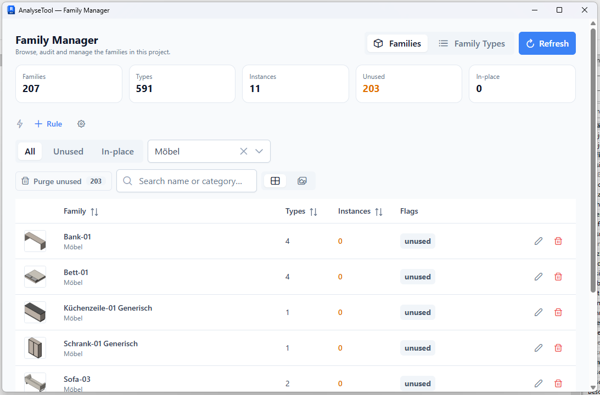
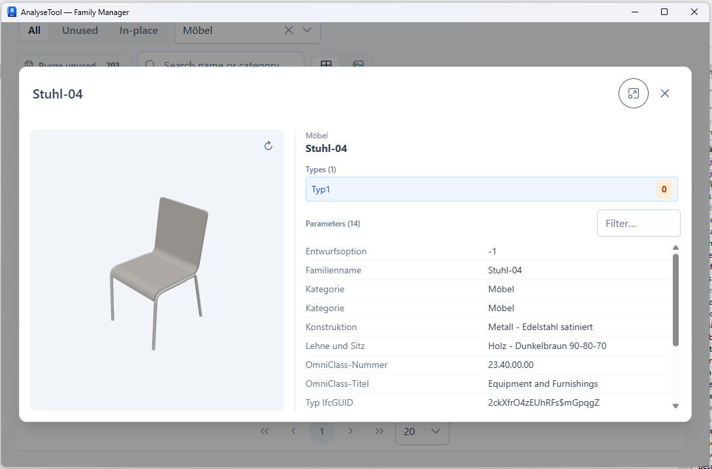
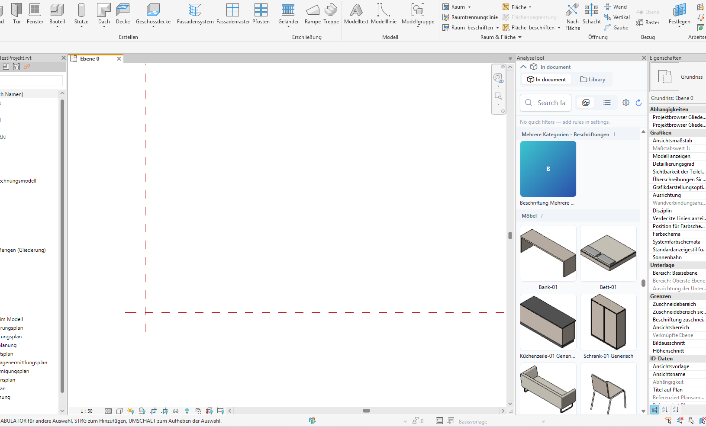
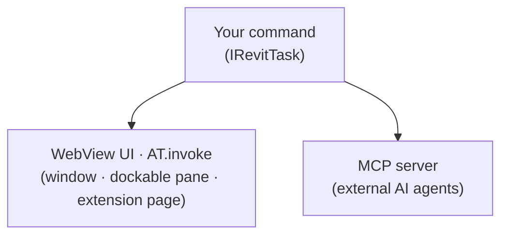
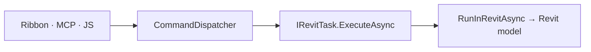
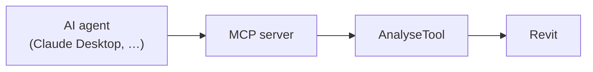
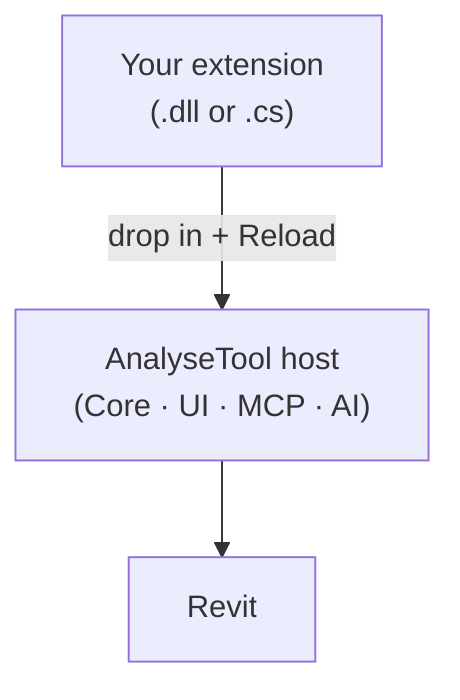
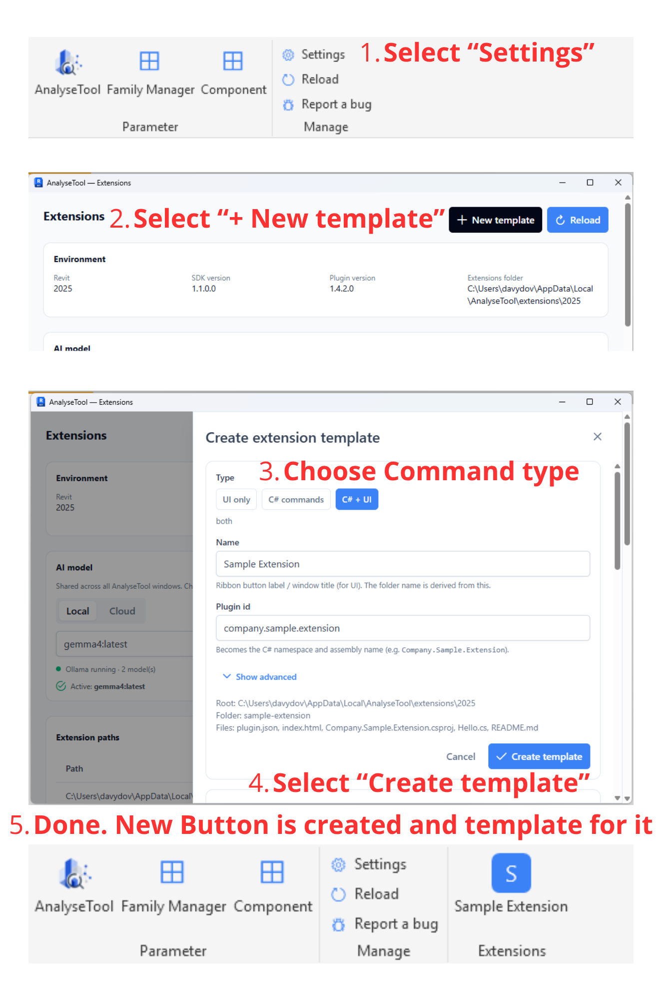

# AnalyseTool for Revit

[](https://github.com/Nikola1Davydov/AnalyzeTool/releases/latest)

[](https://github.com/Nikola1Davydov/AnalyzeTool/blob/main/LICENSE)

[](https://www.nuget.org/packages/AnalyseTool.Sdk)
[](https://linkedin.com/in/nikolai-davydov-4359bba1)

**A free Revit plugin for family & parameter workflows — and an open framework for building your own AI-powered Revit tools.**

Use the built-in tools (Family Manager, a dockable placement palette, parameter analytics), or build on top: write a command **once** and call it from the UI, from AI agents over MCP, and from your own panels. Free local AI via Ollama — your model data stays on your machine.

<p align="center"></p>

---

## Two ways to use it

| 🧰 **Use it** | 🛠️ **Build on it** |
| --- | --- |
| Family Manager, the Component palette, family libraries, parameter tools, local AI. | Shared commands · MCP server · dockable panes · a live extension system · a NuGet SDK. |
| Install the plugin and go. | *Write once, use everywhere.* Ship your own DLL — no host rebuild. |
| [→ Features](#-use-it--features) · [→ Quick start](#quick-start) | [→ Build on it](#-build-on-it--the-framework) |

- YouTube: https://www.youtube.com/@AnalyseTool-Revit
---


# 🧰 Use it — Features


## The ribbon

<p align="center"></p>

Open the **AnalyseTool** tab — three main buttons plus management:

- **AnalyseTool** — the main window: parameters, analytics, bulk editing and AI workflows.
- **Family Manager** — browse, audit and clean up the project's families.
- **Component** — a dockable palette for placing families and loading them from your libraries.
- **Settings / Reload / Report a bug** — configure AI & extensions, reload extensions live, file an issue.

## 🧱 Family Manager

Browse, audit and clean up every family in the project — gallery & table views with thumbnails, an interactive 3D preview, family types (including system families), rename (with AI suggestions), delete, **purge-unused** with a live progress bar, and saved filter rules.

<p align="center"></p>

Click any family for a detail view: an interactive 3D preview next to its types and parameters.

<p align="center"></p>

## 🧲 Component palette & library

A dockable pane (docks next to the Project Browser) for **placing** families: types grouped by family with previews, gallery/table views, search, quick-filter rules and persisted grouping/sorting. Click a type to start Revit's placement.

Switch to **Library** mode to browse your `.rfa` folders: each file shows its embedded thumbnail and the Revit version it was saved in, flags what's already loaded, and loads families into the project in one click (with progress). Files saved in a newer Revit are marked as not loadable.

<p align="center"></p>

## 📊 Parameters

- Category-based parameter exploration with filters (Instance/Type, BuiltIn/Shared/Project).
- Parameter Filled/Empty analytics with chart-driven selection.
- Parameter Value Check workflow.
- Infinite Canvas workflow with AI-assisted edits.
- Select / Isolate actions directly in Revit.

## 🧠 AI — free and local

- Free local AI via **Ollama** — no paid subscription required.
- One shared model across the whole plugin (with an Ollama status indicator); optional cloud models.
- **Your data stays local:** AI runs against models on *your* machine — nothing about your model is sent to us or any AnalyseTool service. Cloud models are opt-in and go directly to the provider you configure.

---

## Quick start

1. **Install** — download the latest installer from [Releases](https://github.com/Nikola1Davydov/AnalyzeTool/releases/latest), close Revit, run it.
2. **Open** — start Revit → the **AnalyseTool** ribbon tab.
3. **(Optional) AI** — install [Ollama](https://ollama.com/download), keep it running, then pick a model once in **Settings**.

<details>
<summary><b>Compatibility, installation details & troubleshooting</b></summary>

### Compatibility
- Revit 2025–2027 on Windows.
- Requires the **Microsoft Edge WebView2 Runtime** (present on most up-to-date Windows; the plugin prompts with a download link if it's missing).

### Installation
1. Download the installer from [Releases](https://github.com/Nikola1Davydov/AnalyzeTool/releases/latest) — pick **SingleUser** (current user, no admin) or **MultiUser** (all users, needs admin).
2. If you switch between SingleUser and MultiUser, **uninstall the previous AnalyseTool first** (otherwise you may end up with two copies / a duplicate ribbon).
3. Close Revit, then run the installer. Windows SmartScreen may warn "unknown publisher" (the build isn't code-signed yet) — choose **More info → Run anyway**.
4. Start Revit and open the **AnalyseTool** ribbon tab.

### AI setup
Install [Ollama](https://ollama.com/download) and keep it running. Then in **Settings** pick the model once — it's shared across every AnalyseTool window:
- **Local models** (recommended): free local Ollama models.
- **Cloud models** (optional): add a model name manually; saved cloud models are remembered.

### Troubleshooting
- **Blank AnalyseTool window** → the WebView2 Runtime is missing; install it and restart Revit.
- **A new extension's ribbon button doesn't appear** → a brand-new button needs a Revit restart the first time; changing an existing extension only needs **Reload** (Settings → Reload).
- **Duplicate AnalyseTool tab / buttons** → both the SingleUser and MultiUser builds are installed; uninstall one.
- **AI tools don't update after toggling MCP** → the AI client caches the tool list; restart the client.
- **Logs** for diagnosing anything: `%LOCALAPPDATA%\AnalyseTool\logs\analysetool-<date>.log`.
</details>

---

# 🛠️ Build on it — the framework

AnalyseTool isn't just a set of tools — it's a small framework for authoring Revit commands and UIs. You add your own **C# commands** and **web UI pages** **without rebuilding the plugin**: they drop into your extensions folder and load live on **Reload**.

## Build once. Use everywhere.

Write a command once as an `IRevitTask`. The dispatcher is transport-neutral, so the same command is instantly callable from **any WebView UI** — a window, the shared dockable pane, or an extension page, all via `AT.invoke` — and from **AI agents over MCP**. No duplicated logic.


```mermaid
flowchart TB
    C["Your command<br/>(IRevitTask)"]
    C --> UI["WebView UI · AT.invoke<br/>(window · dockable pane · extension page)"]
    C --> MCP["MCP server<br/>(external AI agents)"]
```

## Command flow

Everything goes through one dispatcher, and the Revit model is only ever touched inside `RunInRevitAsync` (a valid API context on the Revit thread).


```mermaid
flowchart LR
    A["Ribbon · MCP · JS"] --> B[CommandDispatcher] --> C["IRevitTask.ExecuteAsync"] --> D["RunInRevitAsync → Revit model"]
```

## AI, precisely

Two distinct things — kept separate on purpose:

- **Local AI (Ollama)** — the plugin's own AI features run on your machine.
- **MCP server** — exposes every command (built-in *and* your extensions) to external AI agents like Claude Desktop, so an agent can drive Revit through your commands.


```mermaid
flowchart LR
    AI["AI agent<br/>(Claude Desktop, …)"] --> M[MCP server] --> T[AnalyseTool] --> R[Revit]
```

## Extensions — plug in a DLL, don't fork the host

You don't modify AnalyseTool — you drop an extension next to it. It gets its own ribbon button and can open a window **or reuse the shared dockable pane** (`"dockable": true`). C# command DLLs, web UI pages, and no-build script extensions (a plain `.cs` compiled on the fly) are all supported, and everything reloads live.


```mermaid
flowchart TB
    E["Your extension<br/>(.dll or .cs)"] -->|"drop in + Reload"| AT["AnalyseTool host<br/>(Core · UI · MCP · AI)"]
    AT --> R[Revit]
```

Prefer clicking to typing? **Settings → New template** scaffolds a ready-to-build extension (UI-only, C#, or both) with a `plugin.json`, a sample command, and an `LLM.md` — and adds the ribbon button:

<p align="center"></p>

## Extension quick start (SDK)

```
dotnet add package AnalyseTool.Sdk
```

A command is one small class:

```csharp
using AnalyseTool.Sdk;

[RevitCommand(Description = "Counts the walls in the active document.", ReadOnly = true)]
public sealed class CountWalls : IRevitTask
{
    public Task<object?> ExecuteAsync(IRevitContext revitContext, CancellationToken cancellationToken) =>
        revitContext.RunInRevitAsync<object?>(app =>
        {
            var doc = app.ActiveUIDocument.Document;
            int count = new Autodesk.Revit.DB.FilteredElementCollector(doc)
                .OfClass(typeof(Autodesk.Revit.DB.Wall)).GetElementCount();
            return new { count };
        });
}
```


Add a `plugin.json`, build with a year config (`Release R25` / `R26` / `R27`), drop the output into
`%LOCALAPPDATA%\AnalyseTool\extensions\<RevitYear>\`, and hit **Reload**. Your command is now callable
from JavaScript (`AT.invoke("<id>.CountWalls")`) and from AI clients over MCP — no host rebuild.

📖 **Full authoring guide:** the [GitHub Wiki](https://github.com/Nikola1Davydov/AnalyzeTool/wiki) (mirrored from [`ONBOARDING.md`](ONBOARDING.md)) — the manifest, the SDK contract, deploy & live reload, MCP, and more. Writing with AI? Paste [`LLM.md`](src/LLM.md) into Claude/ChatGPT and it writes AnalyseTool extensions for you.

## Project structure

```
src/
  AnalyseTool.Sdk/        public SDK extension authors compile against (the only contract)
  AnalyseTool.Core/       platform: command queue & dispatcher, extension loader (ALC), scripting
  AnalyseTool.Tools/      built-in feature commands (Get/Families/Ai/Actions) — references ONLY the Sdk
  AnalyseTool.Mcp.Bridge/ in-Revit MCP transport (TCP bridge into the command queue)
  AnalyseTool.Mcp/        out-of-process MCP server the AI client launches (stdio ⇄ TCP)
  AnalyseTool.App/        host UI: windows, ribbon, dockable pane, WebView2 transport, bootstrap
  AnalyseTool.Launcher/   thin Revit add-in shim that loads the host in isolation
  clientapp/              Vue 3 + Vite + PrimeVue frontend
  Installer/              packaging & installation assets
samples/                  example extensions (Acme.Sample doubles as the SDK guardrail in CI)
```

Dependency contract (enforced by `src/build/Check-Boundaries.ps1` in CI): extensions and
`Tools` see only the `Sdk`; transports (`Mcp.Bridge`) plug into `Core` from outside; `App`
composes everything; `Core` and `Tools` are headless (no WPF).


## Feedback

Found a bug or have an idea? Use the [issue tracker](https://github.com/Nikola1Davydov/AnalyzeTool/issues) (or the **Report a bug** ribbon button) and attach the latest log from `%LOCALAPPDATA%\AnalyseTool\logs`. PRs welcome.

## License

AnalyseTool is licensed under the [Apache License 2.0](LICENSE), with one exception: the public extension SDK, [`AnalyseTool.Sdk`](src/AnalyseTool.Sdk), is licensed under the [MIT License](src/AnalyseTool.Sdk/LICENSE) so extension authors can consume it without any strings attached. Bundled third-party components are listed in [THIRD-PARTY-NOTICES.txt](THIRD-PARTY-NOTICES.txt).
