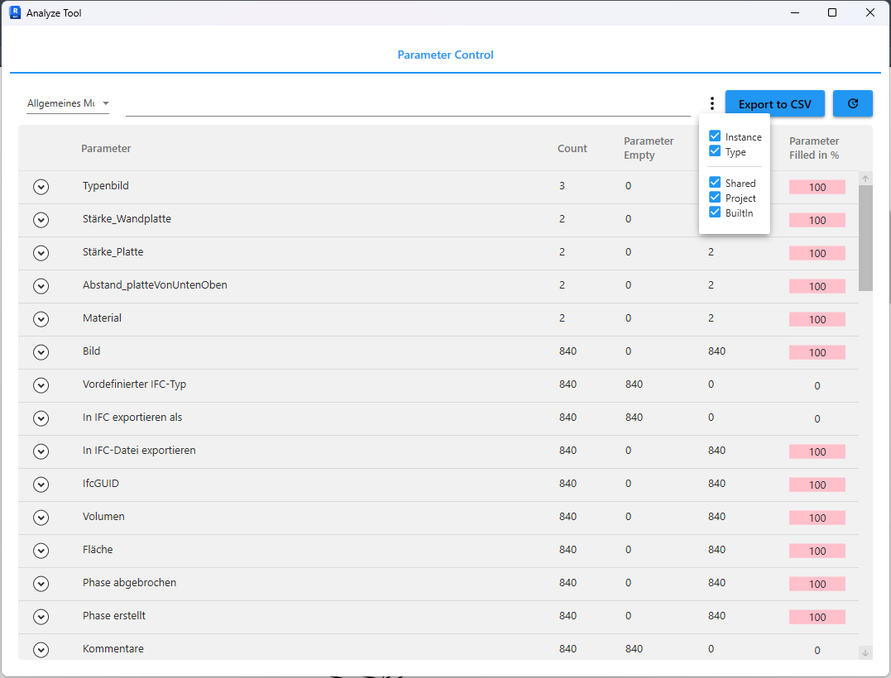

# AnalyseTool for Revit

[](https://github.com/Nikola1Davydov/AnalyzeTool/releases/latest) [](https://github.com/Nikola1Davydov/AnalyzeTool/blob/master/LICENSE)  [](https://linkedin.com/in/nikolai-davydov-4359bba1)

## Overview

AnalyseTool is a Revit plugin that inspects element parameters and lets you act on them right from a modern WebView2 UI. The new frontend is built with Vue + PrimeVue, so anyone who knows only JavaScript or TypeScript can extend the UI and business logic without touching C#.


## Compatibility

- Revit 2025�2026
- Windows with WebView2 and .NET 8

## Features

- View every parameter grouped by category; filter by Instance/Type or BuiltIn/Shared/Project.
- Clickable fill/empty chart to select elements with or without values.
- Select or temporarily isolate elements directly from the web UI.
- Update checker against GitHub releases.

## Installation

1. Download the latest installer/zip from [Releases](https://github.com/Nikola1Davydov/AnalyzeTool/releases/latest).
2. Close Revit and install.

## How to Use

1. Open your project and start `Add-Ins -> AnalyseTool`.
2. Pick a category; parameters and elements load automatically.
3. Use filters to narrow results. Click the chart to select elements with filled/empty values; use isolate to focus the view.

## Architecture

- Backend: `AnalyseTool/RevitCommands` (C#) handles Selection, Isolation, category queries, data retrieval, and update checks.
- Frontend: `clientapp` (Vue 3 + Vite + TypeScript) runs in WebView2 and talks to Revit over a simple message bridge.
- Messaging: `chrome.webview.postMessage` (frontend) ? `WebMessageReceived` (C#).

## Frontend for JS/TS Developers

You can extend the plugin using only JS/TS:

- All web UI code lives in `clientapp` (Vue + PrimeVue).
- Revit interactions go through `clientapp/src/RevitBridge.ts`.

## RevitBridge API (clientapp/src/RevitBridge.ts)

Available commands and payloads:

- `GetCategories` � payload: `null` ? response: `string[]` of category names.
- `GetDataByCategoryName` � payload: `{ categoryName: string }` ? response: `ElementItem[]`.
- `Selection` � payload: `{ elementIds: number[] }` ? selects elements in Revit.
- `Isolation` � payload: `{ elementIds: number[] }` ? isolates elements in the active view.
- `CheckUpdate` � payload: `null` ? response: `{ currentVersion?, latestVersion?, isUpdateAvailable?, releaseUrl? }`.

Data contracts (`clientapp/src/stores/types.ts`):

```ts
export interface ElementItem {
  name: string;
  id: number;
  level: string;
  categoryName: string;
  isElementType: boolean;
  parameters: ParameterData[];
}

export interface ParameterData {
  name: string;
  id: number;
  value: string;
  level: string;
  elementId: number;
  isTypeParameter: boolean;
  orgin: number;
}
```

### JS/TS usage examples

```ts
import { Commands, sendRequest } from "./src/RevitBridge";

// Get categories
const categories = await sendRequest(Commands.GetCategories, null);

// Load elements by category
const walls = await sendRequest(Commands.GetDataByCategoryName, {
  categoryName: "Walls",
});

// Select all loaded elements
await sendRequest(Commands.Selection, { elementIds: walls.map((x) => x.id) });

// Isolate elements with empty parameters
const emptyElementIds = walls
  .filter((el) => el.parameters.some((p) => !p.value))
  .map((el) => el.id);
await sendRequest(Commands.Isolation, { elementIds: emptyElementIds });

// Check for updates
await sendRequest(Commands.CheckUpdate, null);
```

Responses are also delivered via `chrome.webview.addEventListener("message", ...)` � see handling in `clientapp/src/App.vue`.

## Feedback

Open an issue or PR in this repo. If you need more JS/TS APIs or samples, feel free to ask.
