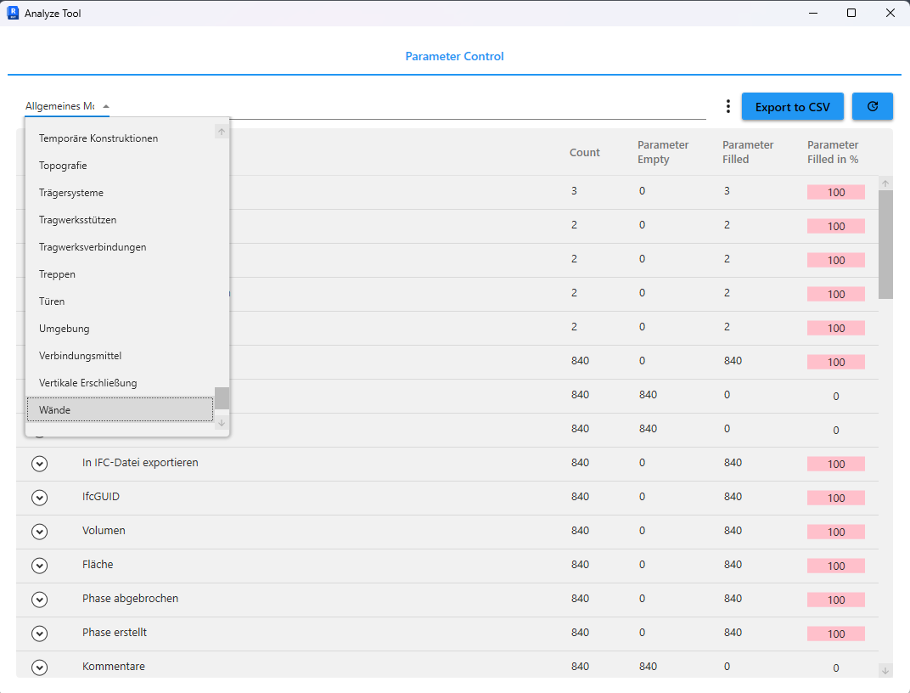

# AnalyseTool Plugin for Revit

[](https://github.com/Nikola1Davydov/AnalyzeTool/releases/latest) [](https://github.com/Nikola1Davydov/AnalyzeTool/blob/master/LICENSE)  [](https://linkedin.com/in/nikolai-davydov-4359bba1)

## Overview


)

The AnalyseTool Plugin is a powerful tool for Autodesk Revit that allows users to analyze and export parameter data of elements within a Revit project. With this plugin, you can easily export data to CSV formats, making it easier to manage and share project information.
## ⚙️ Installation

1. **Download it**: [AnalyseTool Releases](https://github.com/Nikola1Davydov/AnalyzeTool/releases)
2. **Install it**
3. **Use it**
4. **Give some Feedback**

## 🚀 Features

- **Parameter Analysis**: Analyze shared parameters in your Revit project.
- **Export to CSV**: Export analyzed data to a CSV file.
- **Flexible Filtering**: Filter parameters based on various criteria.
- **Category Grouping**: Group parameters by categories for better organization.



## 🛠 Usage

#### Analyzing Parameters

1. **Open Revit Project**: Open your project in Revit.
2. **Launch AnalyseTool**: Go to `Add-Ins` > `AnalyseTool` to launch the plugin.
3. **View Parameters**: The plugin will display a list of parameters for elements in your project.
4. **Filter Parameters**: Use the filter box to search for specific parameters.

#### Export to CSV

1. Click the `Export to CSV` button.
2. Choose the location to save the CSV file.
3. Click `Save`.

## 🔧 Development

#### Prerequisites

- Visual Studio 2019 or higher
- .NET Framework 4.8 & .NET Core 8.0
- CommunityToolkit.Mvvm
- Nice3point.Revit.Api.RevitAPI
- Nice3point.Revit.Api.RevitAPIUI

#### For Developers

1. Clone the repository:
   ```sh
   git clone https://github.com/your-repo/AnalyseTool.git
2. Open the Solution:
   -  Open the solution file in Visual Studio.
3. Restore NuGet Packages:
   - Ensure all required NuGet packages are restored.
4. Build the Solution:
   - Build the project to generate the necessary DLL files.

### 🤝 Contributing

Contributions are what make the open-source community such an amazing place to learn, inspire, and create. Any contributions you make are **greatly appreciated**.

If you have a suggestion that would make this better, please fork the repo and create a pull request. You can also simply open an issue with the tag "enhancement". Don't forget to give the project a star! Thanks again!

1. **Fork the Project**
2. **Create your Feature Branch** (`git checkout -b feature/AmazingFeature`)
3. **Commit your Changes** (`git commit -m 'Add some AmazingFeature'`)
4. **Push to the Branch** (`git push origin feature/AmazingFeature`)
5. **Open a Pull Request**
